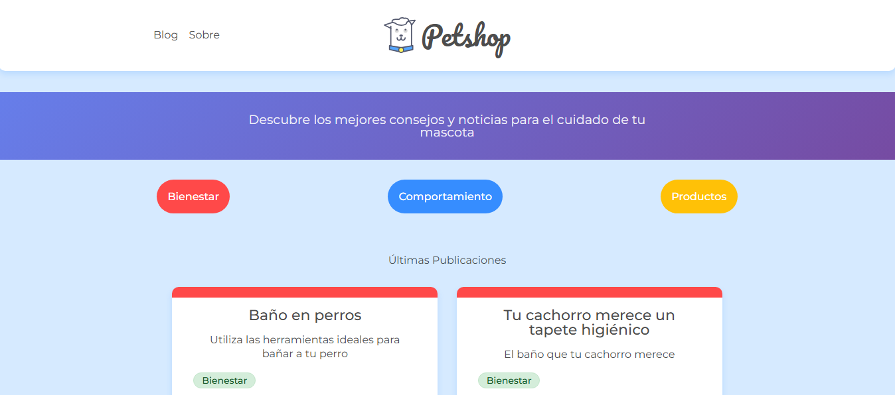

# 🐶 PetClinic SPA

Aplicación web de página única (SPA) construida con **React** para la gestión clínica veterinaria y publicación de noticias sobre mascotas. Este proyecto busca demostrar buenas prácticas de arquitectura, modularidad y experiencia de usuario en entornos frontend modernos.

---

## 📸 Preview del proyecto



---

## 🧩 Características Principales

- ✅ **Single Page Application** con React 18
- ✅ **React Router v6** para navegación fluida
- ✅ **Hooks personalizados** y reutilizables
- ✅ **Context API** para manejo de estado global
- ✅ **Manejo robusto de errores y carga**
- ✅ **Componentes reutilizables y escalables**
- ✅ **Diseño responsivo y UX mejorada**
- ✅ **Integración con API mock vía JSON Server**

---

## 🛠️ Tecnologías Utilizadas

- 
- 
- 
- 
- 

---

### 🚀 Instalación y Uso

⭣ 1. Clona el repositorio

```console
git clone https://github.com/kevinmadrid-dev/spa-petclinic.git
```

⭣ 2. Ingresa a la carpeta del proyecto

```console
cd spa-petclinic
```

⭣ 3. Instala las dependencias

```console
npm install
```

⭣ 4. Inicia app

```console
npm start
```

⭣ 5. Inicia JSON Server en otra terminal

```console
npx json-server --watch db.json --port 5000
```

⭣ NOTA: Si encuentras el warning tar@2.2.2 deprecated, actualízalo

```console
npm i tar
```

---

### Deploy Backend

- Backend SPA PetClinic: [backend-spa-petclinic](https://backend-spa-petclinic.onrender.com)

---

### Contacto

- GitHub: [kevinmadrid-dev](https://github.com/kevinmadrid-dev)
- LinkedIn: [kevinmadrid-dev](https://www.linkedin.com/in/kevinmadrid-dev/)

⭐ Si te gusta este proyecto, ¡dale una estrella en GitHub!
